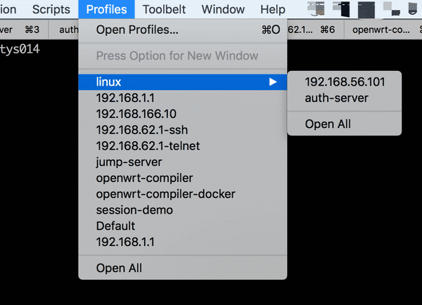
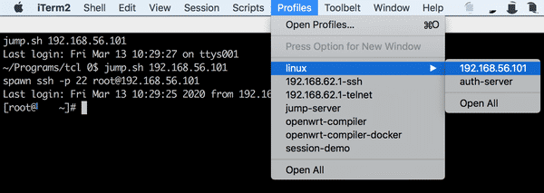
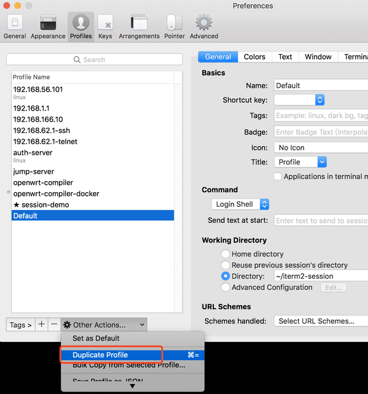
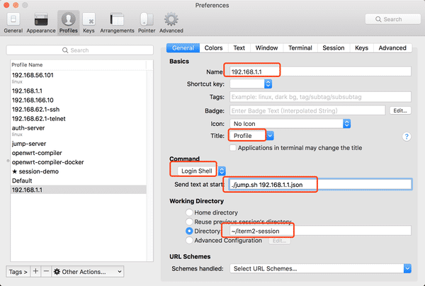

项目介绍
=====================
iterm2 的 session manager

平时要经常登陆公司堡垒机，跳转部门服务器，再跳转到一些设备上，进行操作和传送文件。
进行的操作一般都是重复的一些命令，传送文件使用 lrzsz。

iterm2 和 SecureCRT 都有用，iterm2 的终端显示好一些、lrzsz 文件传送准确性高，而 SecureCRT 的 session manager、button bar 较好用。

一直在寻找 iterm2 上的 session manager 方法，就像 SecureCRT 那样的。把两者融合起来。


我发现 iterm2 的 Profile 功能可以配置成 session manager，又发现 iterm2 的 Trigger 功能支持 lrzsz。如果再实现自动登陆、自动跳转，这事儿就成了。

因此这个方案是三项技术的组合

* iterm2 的 Profile
* iterm2 的 Trigger
* iterm2-session（本程序）

# 安装

下面的教程是 Hello world，设置一个最简单的Profile

效果图如下



当你点击其中一个条目时，会自动登陆。
如下图




## 1. 安装 iterm2-session

找一个目录用来存放程序和配置文件，比如 `~/iterm2-session`

```
git clone https://github.com/ktont/iterm2-session ~/iterm2-session
```

写一个配置文件，比如 192.168.1.1.json

```
cd ~/iterm2-session
cat <<EOF > 192.168.1.1.json
{
    "protocol": "ssh",
    "host": "root@192.168.1.1",
    "password": "123456"
}
EOF
```


## 2. 创建 Profile

iterm2 -> Preferences -> Profiles -> 选中Default -> Other Actions... -> Duplicate Profile

如下图所示




配置 Name、Title、Command、Directory，其中 Command 必须是 `Login Shell`，Directory 必须是 `~/iterm2-session`

如下图所示



* Command `Login Shell`, 意思是创建一个独立的终端
* Directory `~/iterm2-session`，相当于设定工作目录。这个很重要。
* send text as start `./jump.sh 192.168.1.1.json`, 意思是执行这个命令，注意要指定当前目录。

此时，一个最简的session就完成了，在 iterm2 中，快捷键 COMMAND+O，然后双击 `192.168.1.1` 就会去自动登陆 

# 传输文件支持

通过堡垒机跳转的机器，无法使用 scp 传文件。如果只有 telnet，也不能传文件。

就算有 scp，也没有 rz/sz 用起来方便，所以 rz/sz 几乎是必选功能。

这是一个第三方的方案 `iterm2-zmodem`，请使用下面的教程进行安装
https://github.com/aikuyun/iterm2-zmodem

安装好后，不用自动登陆，手工登陆一台服务器测试，确保 sz/rz 可以工作。

## 配置模版
请新建一个 Profile，把 iterm2-zmodem 的 trigger 配置好后，当做一个模版。
每次新增配置的时候，复制这份模版即可。

> iterm2 -> Preferences -> Profiles -> 选中Default -> Other Actions... -> Duplicate Profile

这个动作有快捷键 COMMAND+=

当你使用 sz/rz 时，发现一个 Profile 没有设置 trigger。不要犹豫，立即删除它，然后从 Default 复制一份，填上名称即可。

## 设置 zmodem

如果想要在服务器上执行 rz/sz，则必须在配置文件中指定 zmodem 选项为 true

比如
```
{
    "protocol": "ssh",
    "host": "root@192.168.1.1",
    "password": "123456",
    "zmodem": true
}
```

为什么必须要这个选项呢？因为 iterm2-session 用了 tcl/expect 工具，这个工具和 trigger 不能很好的配合。
有人发现设定字符集可以工作。深层原因不知道，如果你知道原因，请告诉我，谢谢！

所以你使用这个选项后，会发现 iterm2-session 在目标服务器上会重设字符集，以防字符集混乱，请勿怪。

# 使用手册

上面介绍的几个例子，只是 iterm2-session 的一小部分功能。这里列出它的所有功能。

一个尽可能复杂的配置是这样的
```
{
    "protocol": "ssh",
    "user": "your-name",
    "host": "jump-server.corp.com",
    "port": 2222,
    "password": ["blabla1", "blabla2"],
    "zmodem": true,
    "command": "uname -a",
    "jump": {
        "protocol": "ssh",
        "host": "public@10.3.4.5",
        "password": "admin",
        "sudo": true,
        "jump": {
            "protocol": "telnet",
            "host": "root@192.168.1.1:3333",
            "command": ["cd /data", "ls -l"]
        }
    }
}
```

这个例子实际进行的操作如下：
* 支持 zmodem 传文件
* 登陆堡垒机 jump-server.corp.com
* 依次尝试 两个密码，直到成功
* 登陆成功后，执行命令 uname -a
* 第二跳，跳转到 10.3.4.5
* 登陆成功后，执行sudo -s，
* 第三跳，跳转到 192.168.1.1，这次是 telnet
* 登陆成功后，执行两个命令 cd /data 和 ls -l

再补充几点说明
* 密码的个数没有限制，登陆会重试直至成功
* 程序会自动添加空密码，就是空字符串
* 如果sodu需要密码，就在你提供的密码中重试直到成功，和登陆重试一样
* ssh 和 telnet 都可以使用 user@host:port 的 schema
* 如果同时指定了 user 选项和 user@host，那么行为未知
* 如果同时指定了 port 选项和 host:port，那么行为未知
* 跳转的层级无限制，不过一般就 1 跳
* command 和 password 可以单个或者多个

## 再PS

下面是一些高级用法，需要你添加规则

### 关于token

更注重安全的公司的堡垒机上会有 token 认证。
本程序遇到 token 认证时，会睡眠 60 秒，等待你输入 token。
目前只识别 `token:` 或者 `Token:` 这样的字样。
如果贵司的 token 提示不同，请自行修改 expect 脚本。或者，告诉我。

### 关于telnet

很多设备的 telnet 是定制的，特别是厂商自研的网络设备。
本程序只考虑了 `Username:` `login:` 这种提示。
如果你发现有不同的提示，请自行修改 expect 脚本。或者，告诉我。

### 关于Password Manager
iterm2 下 ALT+COMMAND+F 会唤出密码管理器，这个功能和 SecureCRT 的 button bar 类似。
本文一开始也提到了这个 button bar，它是一个很好用的小工具，用来发送密码。

我发现iterm2 的 Password Manager有时候会失灵，交互体验也不太好。
找了很久后，找到一个粘贴板工具凑合着用，它也有一些小问题，密码会从收藏夹里消失。

如果你有更好的方案，请告诉我。

# linux
虽然，初衷是为了搭配 osx 的 iterm2 使用，但是本程序也可以做一个命令行工具使用。可以跑在类 linux 环境下。

# 联系我

1812296219@qq.com


